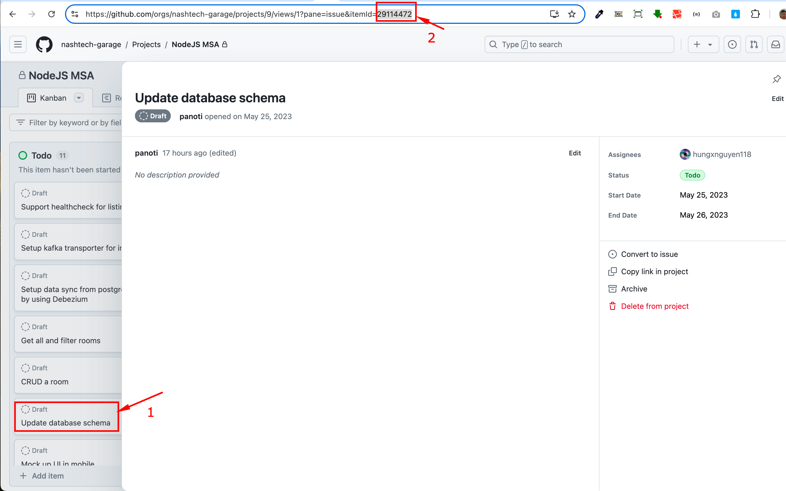

# Table of Contents
1. [Wireframe](#wireframe)
    - [Hone Front](#homefront)
    - [Merchant App](#merchant-app)
2. [Database schema](#database-schema)
3. [Task Creation on Kanban](#task-creation-on-kanban)
4. [Branch Naming Convention](#branch-naming-convention)
5. [Creating a Pull Request on GitHub](#creating-a-pull-request-on-github)

## Wireframe
<details>
  <summary>
    <a href="javascript: void(0)">View Details</a>
  </summary>

### Homefront

|  |  |
| -- | -- |
|  |  |
| -- | -- |
|  |  |

### Merchant App

|  |  |
| -- | -- |
|  |  |
| -- | -- |
|  |  |

</details>

## Database schema
<details>
  <summary>
    <a href="javascript: void(0)"><strong>View Details</strong></a>
  </summary>

The below database schema is designed by using [dbdesigner](https://erd.dbdesigner.net/). You can import this file [room-booking.dbml](/docs/db-schema/room-booking.dbml) into **dbdesigner** to visualize the db schema like the below image.


</details>

## Task Creation on Kanban
When creating a new task on the Kanban board, use the following naming structure for clarity and consistency:
**Convention**

```[<ServiceName>]<Task name>```

* ServiceName: The name of the service in square brackets.
* Task name: A brief description of the task.

**Example**

For a task related to the Listing Service for updating the guideline document, the task name would be:

```[Listing Service] Update guideline document```

By following this structure, we enhance the readability and organization of our Kanban tasks, making it easier for the team to prioritize and manage work.

## Branch Naming Convention
To maintain consistency and clarity in our branching strategy, we follow a specific naming convention for feature branches. This helps all team members understand the purpose of a branch at a glance.

**Convention**

```feature/nodejs-msa-<itemid>-<title slug>```
- feature: Indicates the type of branch (in this case, a feature development).
- nodejs-msa: Refers to the microservice architecture project for Node.js.
: The unique identifier for the feature or task, such as a ticket number or item ID.

**Example**

For a task with item ID 1234 and a description Add login functionality, the branch name would be:

```feature/nodejs-msa-1234-add-login-functionality```

**How to Obtain the Item ID?**



## Creating a Pull Request on GitHub

After you've pushed your branch to the remote repository, follow these steps to create a pull request on GitHub:
Navigate to the repository on GitHub.

1. Go to the "Pull requests" tab.
2. Click the "New pull request" button.
3. Select the branch you created from the list of branches. This will be the branch you want to merge into the main branch.
4. Provide a clear and descriptive title for the pull request. Typically, the title should match the branch name.
5. Fill in the description with details about what changes are being proposed. Include context, screenshots, and references to related tasks or tickets.
6. Assign reviewers, labels, or projects if necessary.
7. Click the "Create pull request" button.

Following these steps ensures that your pull request is properly documented and ready for review by your team.

**Example**


The steps to create a pull request can be broken down as follows:

* Title: The title of the task from GitHub Projects or project management tool.
* Description: "This pull request adds login functionality to the Identity service..."

By following this structure, you make it easier for your team to understand and review your contributions.


